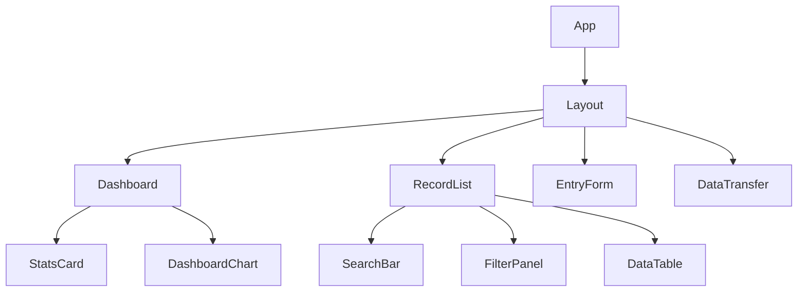

# Dispo - Project Blueprint

## �️ Neden "Dispo"?

Uygulamanın ismi, laboratuvar terminolojisindeki **"Final Disposition"** (Çalışma Sonrası Akıbet) kavramından gelmektedir.

Deney hayvanları yönetiminde "Disposition", bir deney sona erdiğinde hayvana ne yapıldığını ifade eder ve kaydın koloniden düşülmesini temsil eder. Bu terim şunları kapsar:

*   **Ötenazi (Euthanasia):** Hayvanın yaşamına insancıl yollarla son verilmesi.
*   **Transfer:** Başka bir araştırmacıya veya protokole devredilmesi.
*   **Doğal Ölüm (Found Dead):** Deney sırasında kendiliğinden gerçekleşen ölüm.
*   **Sahiplendirme (Adoption):** Hayvanın deney dışı bir yuvaya verilmesi.

**Dispo**, bu kritik "Disposition" sürecini kayıt altına almak ve yönetmek için tasarlanmıştır.

## �🌟 Vizyon

Dispo, laboratuvar ortamlarında hayvan kullanımının takibini **zahmetsiz, hatasız ve şeffaf** hale getirmeyi hedefler. Araştırmacıların bürokratik yükünü azaltarak bilimsel çalışmalara odaklanmalarını sağlar.

### Temel Değerler
1.  **Verimlilik:** En az tıklama ile en hızlı veri girişi.
2.  **Doğruluk:** Kullanıcı hatalarını önleyen validasyonlar ve otomatik hesaplamalar.
3.  **Şeffaflık:** Anlık raporlar ve net veri görselleştirme.

## 🎨 Tasarım Felsefesi

-   **Minimalizm:** Arayüz, sadece gerekli olanı sunar. Karmaşık menüler ve gereksiz detaylardan arındırılmıştır.
-   **Odaklanma:** Kullanıcının o anki görevine (veri girişi veya analiz) odaklanmasını sağlayan temiz bir düzen.
-   **Geri Bildirim:** Her işlemden sonra kullanıcıya net görsel geri bildirimler (başarı mesajları, yükleniyor durumları).

## 🏗️ Sistem Mimarisi

Dispo, ölçeklenebilirlik ve bakım kolaylığı için modern, sunucusuz (serverless) bir mimari üzerine inşa edilmiştir.

### Katmanlar

1.  **İstemci (Client):**
    *   **Teknoloji:** React + Vite
    *   **Rolü:** Kullanıcı arayüzü, state yönetimi, form validasyonu.
    *   **Dağıtım:** Statik web sitesi (Vercel/Netlify).

2.  **API (Serverless):**
    *   **Teknoloji:** Vercel Serverless Functions (Node.js)
    *   **Rolü:** İş mantığı, veritabanı bağlantısı, güvenli veri işleme.
    *   **Avantajı:** Sunucu yönetimi gerektirmez, sadece istek anında çalışır.

3.  **Veri (Data):**
    *   **Teknoloji:** MongoDB Atlas
    *   **Rolü:** Kalıcı veri saklama.
    *   **Yapı:** Esnek, doküman tabanlı şema.

## 📐 Veri Modeli Blueprint

`animals` koleksiyonu için veri doğrulama kuralları ve alan tanımları:

| Alan | Tip | Zorunlu | Validasyon / Kural |
| :--- | :--- | :---: | :--- |
| `removalDate` | String (ISO Date) | ✅ | Geçerli bir tarih olmalı. Gelecek tarih seçilemez. |
| `reason` | Enum (String) | ✅ | Tanımlı kodlardan biri olmalı (örn: EXP-01, CULL-02). |
| `count` | Integer | ✅ | 0'dan büyük tam sayı olmalı. |
| `species` | Enum (String) | ✅ | "Mouse", "Rat" vb. |
| `strain` | String | ✅ | Boş olamaz. |
| `gender` | Enum (String) | ✅ | "Male", "Female", "Unknown". |
| `project` | String | ❌ | Proje kodu formatına uygunluk (opsiyonel). |
| `notes` | String | ❌ | Maksimum 500 karakter. |

## 🧩 Bileşen Hiyerarşisi

Uygulamanın temel bileşen ağacı:

## 🗺️ Yol Haritası (Roadmap)

Projenin gelecekteki gelişim aşamaları:

### Faz 1: Temel Özellikler (Tamamlandı ✅)
- [x] Kayıt ekleme/silme/listeleme
- [x] Temel dashboard istatistikleri
- [x] Veri import/export

### Faz 2: Güvenlik ve Çoklu Kullanıcı (Planlanan 🚧)
- [ ] **Kimlik Doğrulama:** Auth0 veya NextAuth entegrasyonu.
- [ ] **Rol Yönetimi:** Admin (tüm veriler) vs. Araştırmacı (kendi verileri).
- [ ] **Audit Logs:** Kimin hangi kaydı ne zaman değiştirdiğinin takibi.

### Faz 3: Gelişmiş Raporlama
- [ ] **PDF Raporlar:** Resmi formatta aylık döküm alma.
- [ ] **Excel Export:** Özelleştirilebilir sütunlarla Excel çıktısı.
- [ ] **E-posta Bildirimleri:** Aylık limit aşımlarında uyarı.

### Faz 4: Mobil Deneyim
- [ ] **PWA Desteği:** Uygulamanın telefona kurulabilir hale gelmesi.
- [ ] **Offline Mod:** İnternet yokken veri girişi yapabilme ve senkronizasyon.
